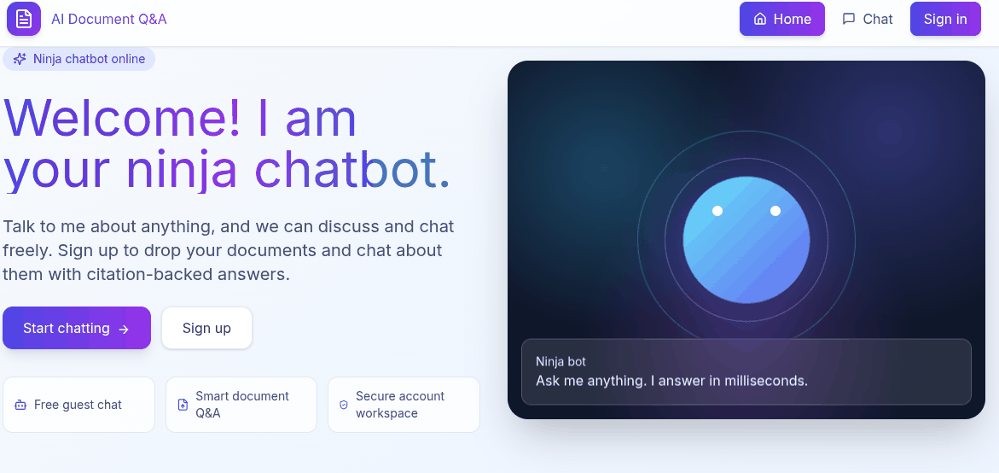
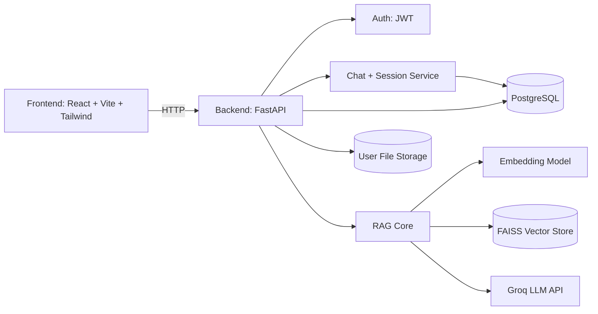

# 🤖 AI Document RAG Chatbot

<p align="left">
  
  
  
  
  
  
  
</p>

AI-powered question-answering chatbot built with a **responsive React frontend**, a **FastAPI backend**, **PostgreSQL**, and **FAISS**.  
It supports both **guest chat** and **authenticated document-grounded chat** with persistent history.

## 🎬 Demo

> Add your GIF demo at `frontend/public/screenshots/demo.gif` and keep this block as-is for GitHub rendering.



### 🧭 What Users Can Do

- chat freely as a guest,
- sign in to upload PDF/DOCX files,
- ask document-grounded questions with retrieval,
- continue conversations with persistent chat history.

- **Responsive frontend** with React, TypeScript, Vite and Tailwind CSS.
- **Backend API** using FastAPI for ingestion, querying, authentication, and chat history.
- **JWT multi-user support** with per-user vector isolation and storage.
- **Vector retrieval** powered by FAISS embeddings.
- **Persistent chat logs** stored in PostgreSQL via SQLAlchemy.
- **Docker Compose ready**: backend + database (and optionally static frontend files) in one command.
- **RAG pipeline** using CPU‑friendly LLMs for retrieval‑augmented generation.

---

## ✨ Key Features

- 🔐 **JWT authentication** with per-user isolation
- 📄 **Document upload** (PDF/DOCX) directly from chat input
- 🧠 **RAG pipeline** (ingest, embed, retrieve, answer)
- 🗂️ **Per-user vector indexes** with model-safe FAISS index naming
- 💬 **Chat sessions sidebar** (`New Chat +`, session switching, persisted history)
- ⏱️ **Prompt limit per chat** with remaining-counter UX
- 🐳 **Docker Compose ready** for fast local deployment

---

## 🏗️ Architecture Overview



- Frontend in `frontend/` handles uploads, chat UI and user interactions.
- Backend in `backend/app/` exposes `/upload`, `/query`, `/chat`, `/auth` routes.
- Data layer: PostgreSQL for users/chat, filesystem for documents, FAISS for embeddings.
- Core RAG code lives in `rag_core/` and is framework-agnostic.

## 🖼️ Project Preview

> Screenshots are loaded from `frontend/public/screenshots` and linked with URL-encoded paths for GitHub compatibility.


---

## 🧩 Backend API Overview

- `POST /auth/signup` – create account
- `POST /auth/login` – login and receive token
- `GET /auth/me` – authenticated user info
- `POST /upload/pdf` – upload and ingest PDF
- `POST /upload/docx` – upload and ingest DOCX
- `POST /query` – authenticated RAG query (`chat_id` supported)
- `POST /chat/general` – guest/general chat
- `GET /chat/sessions` – list user chat sessions
- `POST /chat/sessions` – create new chat session
- `GET /chat/sessions/{session_id}/messages` – fetch session messages

Interactive docs: [http://localhost:8000/docs](http://localhost:8000/docs)

---

## ⚙️ Environment Variables

Create `.env` with at least:

- `POSTGRES_DB`, `POSTGRES_USER`, `POSTGRES_PASSWORD`
- `JWT_SECRET_KEY`, `JWT_ALGORITHM`, `ACCESS_TOKEN_EXPIRE_MINUTES`
- `GROQ_API_KEY`, `GROQ_MODEL`
- `HF_TOKEN` (if needed for model pulls)
- `EMBEDDING_MODEL` (default: `sentence-transformers/all-MiniLM-L6-v2`)

---

## 🚀 Quick Start (Docker)

```bash
docker compose up -d --build
```

Services:

- Backend: [http://localhost:8000](http://localhost:8000)
- API Docs: [http://localhost:8000/docs](http://localhost:8000/docs)
- Adminer: [http://localhost:8080](http://localhost:8080)

---

## 💻 Local Development (Without Docker)

### Backend

```bash
python -m venv .venv
source .venv/bin/activate
pip install -r requirements.txt
uvicorn backend.app.main:app --reload --host 0.0.0.0 --port 8000
```

### Frontend

```bash
cd frontend
npm install
npm run dev
```

---

## 📁 Project Structure

```text
backend/
  app/
    auth/            # auth routes, jwt deps, password utils
    core/            # config/settings
    db/              # SQLAlchemy engine/session/init
    models/          # User, Document, ChatSession, ChatHistory
    routers/         # auth, upload, query, chat
    services/        # rag service, chat service, storage service
    schemas/         # request/response models

rag_core/
  generation/        # prompts + LLM wrapper
  ingestion/         # PDF/DOCX loaders and chunking
  pipeline/          # ingest/query orchestration
  retrieval/         # embedder + FAISS vector store

frontend/
  src/
    components/      # UI sections (chat, auth, header)
    lib/             # API client
    styles/          # Tailwind styles
  public/screenshots # README preview images
```


